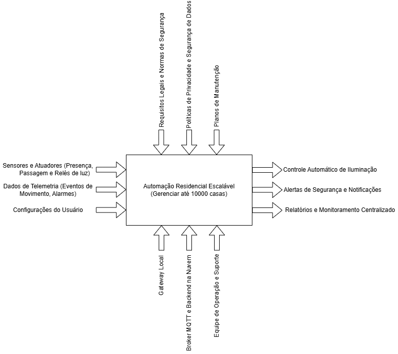
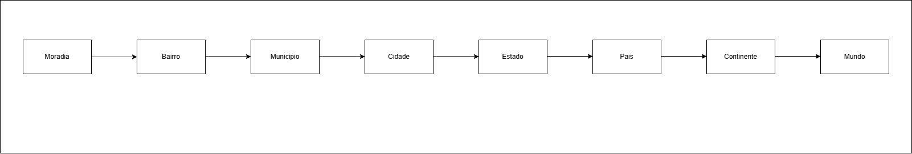
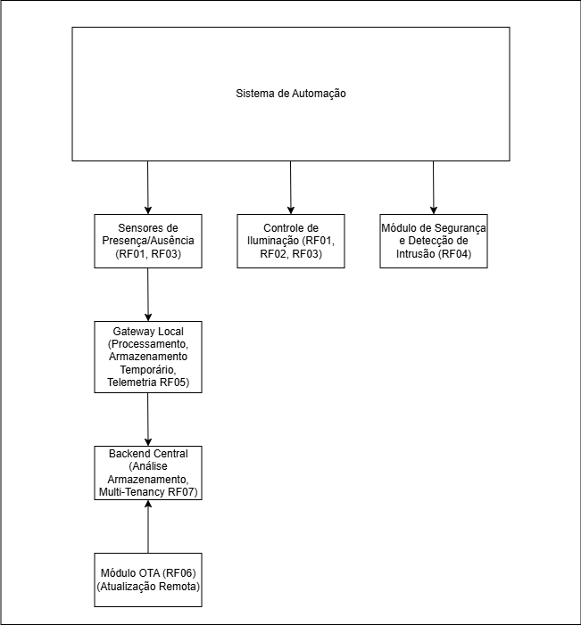
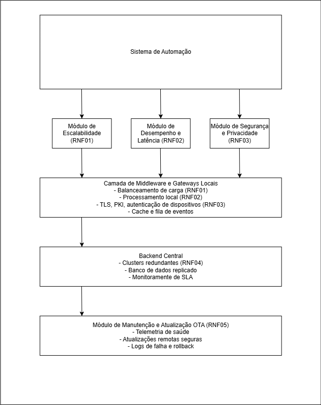

# Proposta de Solução para Sistema de Automação Residencial Escalável

Este documento detalha uma proposta de solução para um sistema de automação residencial, com foco na escalabilidade para atender até 10.000 residências. Utilizando a modelagem RM-ODP (Reference Model of Open Distributed Processing), que nos permite abordar o sistema sob cinco visões distintas.

### Problemática

Inicialmente, o projeto visava a automação de uma única casa, com funcionalidades de detecção de presença para controle de iluminação e segurança contra invasores. A problemática é expandir essa capacidade para 10.000 moradias. Isso implica em uma abstração e modelagem do sistema que considere não apenas o ambiente interno de cada moradia (sensores e atuadores), mas também a interconexão em uma rede local e, posteriormente, em uma rede maior, com uma estrutura hierárquica que englobe agrupamentos de moradias.

### Visão 1: Drivers de Negócio (O Porquê)

Figura 1 - IDEF0 
 
Fonte: Material produzido pelos autores (2025) 

Figura 2 - Agrupamento 
 
Fonte: Material produzido pelos autores (2025) 

### Visões 2 e 3: Requisitos Funcionais e Não Funcionais (UML)

#### Requisitos Funcionais (RFs)

Os Requisitos Funcionais são:

*   **RF01 - Detecção de Presença:** O sistema deve ser capaz de detectar a entrada de uma pessoa em um cômodo e sinalizar este evento ao gateway local.
*   **RF02 - Controle de Iluminação:** Ao detectar a presença, o sistema deve acionar o atuador para ligar a luz do cômodo. A luz deve ser ligada a partir do evento do sensor.
*   **RF03 - Detecção de Ausência e Desligamento:** O sistema deve detectar a ausência de pessoas em um cômodo e desligar a luz.
*   **RF04 - Detecção de Intrusão:** O sistema deve identificar padrões de movimento que indiquem uma intrusão (por exemplo, movimento quando a casa está vazia) e disparar um alarme, além de notificar o morador e o serviço central.
*   **RF05 - Coleta de Dados e Telemetria:** O sistema deve registrar eventos (entrada, saída, alarme, saúde do dispositivo) localmente e enviar esses dados para um backend central para análise e monitoramento.
*   **RF06 - Atualização Remota (OTA):** O sistema deve permitir a atualização segura do firmware do gateway e dos dispositivos de forma remota (Over-The-Air).
*   **RF07 - Multi-tenancy Básica:** O sistema deve garantir a associação dos dados por casa, ou seja, cada residência deve ter acesso apenas aos seus próprios dados.

Figura 3 - RFs 
 
Fonte: Material produzido pelos autores (2025) 

#### Requisitos Não Funcionais (RNFs)

Os seguintes Requisitos Não Funcionais mínimos e mensuráveis:

1.  **RNF01 - Escalabilidade:** O sistema deve ser capaz de suportar 10.000 casas simultaneamente. A métrica de aceitação é que o sistema deve processar até 1.000.000 de eventos por dia (uma estimativa conservadora) sem perda significativa de dados (menos de 0.1% de perda).
2.  **RNF02 - Tempo de Resposta (Tempo Real Leve):** As ações críticas, como ligar e desligar a luz, devem ocorrer com baixa latência. A métrica é que a ação completa (do sensor ao atuador) deve levar menos de 500 milissegundos em condições normais de rede local. Isso será alcançado com a lógica de decisão embarcada no gateway local.
3.  **RNF03 - Segurança e Privacidade:** A comunicação dentro do sistema deve ser autenticada e cifrada, e os dispositivos devem possuir uma identidade única. A métrica inclui o uso de TLS para comunicação com a nuvem, autenticação por certificado ou elemento seguro, e a proteção de credenciais do proprietário. Testes de penetração básicos e revisão de rotinas de atualização segura serão realizados.
4.  **RNF04 - Confiabilidade e Disponibilidade:** Os serviços críticos de controle local devem continuar funcionando mesmo com a perda temporária de conexão com a nuvem. A métrica é que a funcionalidade local (acionamento de luzes) deve ser 100% funcional durante a perda de conexão, e o backend na nuvem deve ter um SLA de 99.9% de disponibilidade. Isso será verificado desligando a conexão com a nuvem e observando o comportamento do sistema.
5.  **RNF05 - Manutenibilidade e Atualizabilidade:** Os dispositivos, mesmo que de baixo custo, devem suportar atualizações OTA e telemetria de saúde. A métrica é que 95% dos dispositivos devem receber atualizações OTA com sucesso ou agendar um fallback, e alertas devem ser gerados em caso de falha de firmware. Isso será testado liberando atualizações e medindo a taxa de sucesso.

Figura 4 - RNFs 
 
Fonte: Material produzido pelos autores (2025) 

### Visão 4: Decisões de Engenharia (Como Fazer)

Esta visão detalha a arquitetura e os componentes que serão utilizados para construir o sistema. A abordagem é hierárquica, permitindo o agrupamento de casas e a otimização do fluxo de dados.

**Arquitetura Lógica em Camadas:**

*   **Camada de Dispositivo (por casa):** Inclui sensores (SA para presença/atuação, SP para passagem), atuadores (AT para controle de luz, como relés), e microcontroladores (como ESP32) conectados a um **Gateway Local**. Este gateway, que pode ser um Raspberry Pi ou similar, executa um cliente MQTT leve e a lógica de controle local. Sua responsabilidade principal é garantir baixa latência nas ações críticas.
*   **Gateway/Edge por Casa:** Este componente processa eventos, aplica regras locais, armazena logs temporariamente, gerencia atualizações OTA para os dispositivos e replica eventos para um agregador regional. É essencial para manter a baixa latência.
*   **Agregador Regional:** Um cluster de brokers MQTT e microsserviços de ingestão, responsável por coletar dados de múltiplos gateways (por exemplo, por bairro ou região). Este nível agrega logs, aplica políticas e reduz a carga no backend central.
*   **Backend Central (Nuvem):** Consiste em serviços REST/WebSocket, bancos de dados para configuração, painel administrativo, ferramentas de análise e sistemas de alerta (SMS/push).
*   **Operações/Manutenção:** Inclui ferramentas para telemetria, logs centralizados e sistemas de alerta.

**Protocolos Recomendados:**

*   **Sensor ↔ Gateway:** Wi-Fi (para ESP32) se a simplicidade e o custo forem prioritários.
*   **Gateway ↔ Nuvem:** MQTT sobre TLS (para comunicação eficiente e segura) ou HTTPS para telemetria.
*   **Gerenciamento/OTA:** Um serviço customizado sobre HTTPS para garantir a integridade das atualizações.

**Componentes Físicos Sugeridos (foco em custo e manutenibilidade):**

*   **Sensores:** PIR (infravermelho passivo) genéricos para presença; sensores IR/beam ou acelerômetros para detecção de passagem em portas.
*   **Atuadores:** Módulos de relé 5V/12V com opto-isolação para controle de iluminação.
*   **Microcontroladores (MCU):** ESP32, devido ao seu baixo custo, suporte a Wi-Fi e BLE, e capacidade de OTA. Para segurança adicional, pode-se considerar o uso de um elemento seguro como o ATECC608A.
*   **Gateway Local:** Raspberry Pi Zero 2/3 ou equivalente, oferecendo poder de processamento suficiente para as regras locais.

**Topologia de Agrupamento:**

A estrutura proposta é: **Moradia** → **Gateway Local (1 por casa)** → **Agregador Regional (para cada 500-2000 casas, dependendo da infraestrutura)** → **Bairro** → **Municipio** → **Cidade** → **Estado** → **País** → **Continente** → **Mundo** → **Backend Central**. Cada nível nesta hierarquia é responsável por agregar logs, aplicar políticas e reduzir a carga no nível subsequente, utilizando balanceamento de carga e clusters para o backend central.

### Visão 5: Plataformas, Ferramentas e Linguagens (Com o Quê)

*   **Código Edge / Gateway:** Node.js ou Python são excelentes escolhas, dada a experiência com JavaScript e Python. A biblioteca MQTT.js é uma boa opção para Node.js.
*   **Firmware do Dispositivo:** C/C++ com ESP-IDF/Arduino para o firmware do ESP32.
*   **Broker MQTT:** EMQX para escalabilidade em larga escala.
*   **Backend:** Python (com FastAPI) para a construção de microsserviços conteinerizados.
*   **Bancos de Dados:** PostgreSQL para dados de configuração e autenticação; TimescaleDB ou InfluxDB para séries temporais (dados de telemetria); Redis para cache.
*   **Infraestrutura:** Docker para orquestração e escalabilidade; Prometheus e Grafana para monitoramento.
*   **CI/CD / OTA:** scripts de deploy com assinatura para segurança.
*   **Segurança:** Implementação de TLS para todas as comunicações, JWT (JSON Web Tokens) para autenticação de APIs, e PKI (Public Key Infrastructure) com certificados para a identidade dos dispositivos.

